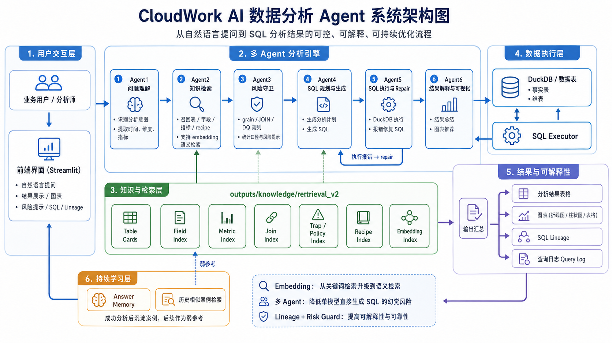

# CloudWork AI 数据分析 Agent

一个面向中文业务问题的 Text-to-SQL 数据分析项目。  
项目目标不是“直接让大模型猜 SQL”，而是先构建可检索、可约束、可解释的业务知识库，再通过多 Agent 流程完成：

`用户问题 -> 任务理解 -> 知识检索 -> Grain / DQ 守卫 -> SQL 生成 -> SQL 执行 / 修复 -> 结果回答 / 可视化`



上图概括了项目的整体结构：用户通过 CLI 或 Streamlit 提问，问题进入多 Agent 分析引擎；引擎从 `retrieval_v2` 检索表、字段、指标、JOIN、trap、policy、recipe 与 embedding 索引；最终在 DuckDB 上执行 SQL，并输出结果表、图表、lineage 与 query log。成功案例还会沉淀为 answer memory，作为后续相似问题的弱参考。

本项目同时提供：
- 命令行版本：[src/04_agent_cli.py](/Users/zhang/Desktop/飞书比赛/src/04_agent_cli.py)
- Streamlit 前端：[src/05_streamlit_app.py](/Users/zhang/Desktop/飞书比赛/src/05_streamlit_app.py)

---

## 1. 项目简介

在真实 BI / 数据分析场景中，Text-to-SQL 的难点通常不是 SQL 语法本身，而是：
- 业务口径不清
- 表粒度（grain）容易混淆
- 一对多 JOIN 容易导致重复统计
- 指标与事实表混用，导致结论错误
- 纯 schema 难以支撑中文业务问答

因此，本项目并不是“让大模型直接猜 SQL”，而是先构建知识库，再通过多 Agent 流程完成分析。项目定位更接近一个**可解释、可校验、可持续优化**的数据分析 Agent。

---

## 2. 核心功能实现

- 支持中文自然语言提问，自动生成 DuckDB SQL
- 基于知识库检索相关表、字段、指标、JOIN 路径和 recipe
- 支持 hybrid retrieval：保留关键词检索，并用 embedding 增强 table / field / metric / recipe 的语义召回
- 在 SQL 生成前加入 grain / DQ 约束，降低错误聚合风险
- 支持 SQL 执行失败后的自动 repair
- 支持 SQL 引用校验与结果校验，减少“能执行但结果明显不合理”的情况
- 支持 answer memory，将成功分析沉淀为弱参考历史案例
- 输出结果表、图表、lineage 和 query log
- 提供 CLI 和 Streamlit 两种使用方式

---

## 3. 知识库架构

### 3.1 为什么要做知识库

如果只把数据库 schema 给大模型，模型很容易：
- 只看字段名猜业务含义
- 把记录数当实体数
- 把 MRR、实收、发票、付款等不同口径混在一起
- 不知道哪些字段可 JOIN、哪些 JOIN 会放大

因此项目将数据库知识拆成多层：
- 原始 schema 层
- profiling 层
- table card 层
- validation / audit 层
- retrieval index 层
- embedding retrieval 层
- answer memory 层
- visualization rule 层

### 3.2 核心知识源

项目的核心知识源是 `knowledge_manual/table_cards/*.yaml`。  
每张 table card 不只是字段说明，而是包含：
- 业务含义
- grain
- 主键 / 自然键
- JOIN 路径
- 推荐指标
- known traps
- aggregation notes
- validation 结果

### 3.3 retrieval_v2

`retrieval_v2` 是 Agent 运行时使用的正式检索底座，核心包括：
- `table_index.json`
- `field_index.json`
- `metric_index.json`
- `join_index.json`
- `trap_index.json`
- `policy_index.json`
- `recipe_index.json`
- `recipes.json`

其中：
- `table / field / metric / recipe` 支持 hybrid retrieval
- `join / trap / policy` 保持结构化检索，避免语义相关但结构错误的 JOIN 进入 SQL

### 3.4 其他知识产物

- `visualization_rules.json`：图表推荐规则
- `memory/answer_memory.jsonl`：成功查询后的历史案例记忆
- `answer_memory_index.json` / `answer_memory_embedding_index.json`：answer memory 的检索索引

---

## 4. Agent 架构

基于流程图，项目的主链路可以概括为三部分。

### 4.1 多 Agent 分析

- `Agent1`：任务理解，识别问题中的时间、维度、指标和结果形态
- `Agent2`：知识检索，从 `retrieval_v2` 中召回表、字段、指标、JOIN、recipe 和历史案例
- `Agent3`：风险守卫，补充 grain / JOIN / DQ 约束
- `Agent4`：SQL 规划与生成
- `Agent5`：DuckDB 执行与 repair
- `Agent6`：结果解释与可视化

### 4.2 执行与校验

除了生成 SQL，系统还会执行以下校验：
- 只允许 `SELECT / WITH`
- 检查表和字段引用是否合理
- 检查结果形态是否符合问题预期
- 如果执行失败或校验失败，进入 repair

### 4.3 输出与可解释性

无论在 CLI 还是 Streamlit 前端，系统都可以输出：
- 候选表 / 候选 recipe
- 风险提示
- 分析计划
- SQL
- 结果预览
- 图表
- SQL lineage
- query log

---

## 5. Good to Have 内容实现

### 5.1 SQL Lineage

项目支持基础版 lineage，可展示：
- 本次分析使用的表和字段
- SQL 的 JOIN / GROUP BY / ORDER BY / LIMIT 特征
- 结果列 schema
- 图表的 x / y 映射

对应代码：
- [src/06_lineage.py](/Users/zhang/Desktop/飞书比赛/src/06_lineage.py)

### 5.2 全局知识图谱 / ER 图

项目支持根据知识库自动生成全局图谱：
- 表作为节点
- JOIN 关系作为边
- 边上展示 join_condition、relationship 和 risk_level

对应代码：
- [src/08_build_knowledge_graph.py](/Users/zhang/Desktop/飞书比赛/src/08_build_knowledge_graph.py)

### 5.3 多轮追问

系统支持基础版 follow-up context：
- 保存上一轮成功分析的问题、SQL、结果列、结果预览、图表配置和 lineage
- 后续问题可以在上一轮基础上继续修改过滤条件、排序、TopN、图表类型或时间维度

### 5.4 Answer Memory

系统支持轻量的持续学习能力：
- 成功查询后，会异步生成一条保守的历史案例描述，写入 `outputs/memory/answer_memory.jsonl`
- 后续可编译成检索索引
- Agent2 最多只检索 1 条历史相似案例，作为 SQL Planner 的弱参考
- answer memory 不会覆盖正式知识库和 Agent3 guardrails

---

## 6. Getting Started

### 6.1 Python 依赖

本项目依赖见 [requirements.txt](/Users/zhang/Desktop/飞书比赛/requirements.txt)。

建议使用虚拟环境：

```bash
python3 -m venv .venv
source .venv/bin/activate
pip install -r requirements.txt
```

### 6.2 环境变量配置

当前 LLM 调用默认接入 SiliconFlow 兼容接口。  
请在项目根目录创建 `.env` 文件。除了 API Key，数据目录和 DuckDB 路径也支持通过环境变量覆盖：

```bash
SILICONFLOW_API_KEY=你的APIKey
SILICONFLOW_API_URL=https://api.siliconflow.cn/v1/chat/completions
SILICONFLOW_MODEL=Qwen/Qwen2.5-72B-Instruct
SILICONFLOW_EMBEDDING_API_URL=https://api.siliconflow.cn/v1/embeddings
SILICONFLOW_EMBEDDING_MODEL=BAAI/bge-m3
CSV_DIR=for_contestants/csv
DUCKDB_PATH=cloudwork.duckdb
```

说明：

- `SILICONFLOW_API_KEY`：必填，用于调用 LLM 接口
- `SILICONFLOW_API_URL`、`SILICONFLOW_MODEL`：可选，不填时使用代码中的默认值
- `SILICONFLOW_EMBEDDING_API_URL`、`SILICONFLOW_EMBEDDING_MODEL`：可选，用于 hybrid retrieval 的 embedding 构建与查询
- `CSV_DIR`：可选，37 张原始 CSV 表所在的目录；默认值为项目根目录下的 `for_contestants/csv`
- `DUCKDB_PATH`：可选，DuckDB 数据库文件路径；默认值为项目根目录下的 `cloudwork.duckdb`
- `CSV_DIR` 和 `DUCKDB_PATH` 支持相对路径或绝对路径；相对路径会按项目根目录解析

### 6.3 快速启动

如果仓库中的数据库和知识库产物已经存在，可直接启动：

```bash
python3 src/04_agent_cli.py
```

或启动 Streamlit 前端：

```bash
streamlit run src/05_streamlit_app.py
```

如果本地还没有 `DUCKDB_PATH` 对应的数据库文件，可以先运行：

```bash
python3 src/00_load_data.py
```

该脚本会从 `CSV_DIR` 指向的 37 张原始表目录中读取数据，并生成 DuckDB 数据库文件。

### 6.4 完整复现

如果需要从原始 CSV 全量重建，请按以下顺序执行：

```bash
python3 src/00_load_data.py
python3 src/01_profile_tables.py
python3 src/02_sample_questions.py
python3 src/03_build_knowledge_base.py
python3 src/03_6_build_retrieval_indexes_from_cards_v2.py
python3 src/03_8_build_recipe_knowledge.py
python3 src/03_8_build_embedding_indexes.py
python3 src/03_7_build_visualization_knowledge.py
```

然后再启动：

```bash
streamlit run src/05_streamlit_app.py
```

### 6.5 可选步骤

如果需要提前构建 answer memory 检索索引，可额外执行：

```bash
python3 src/08_build_answer_memory_index.py
```
